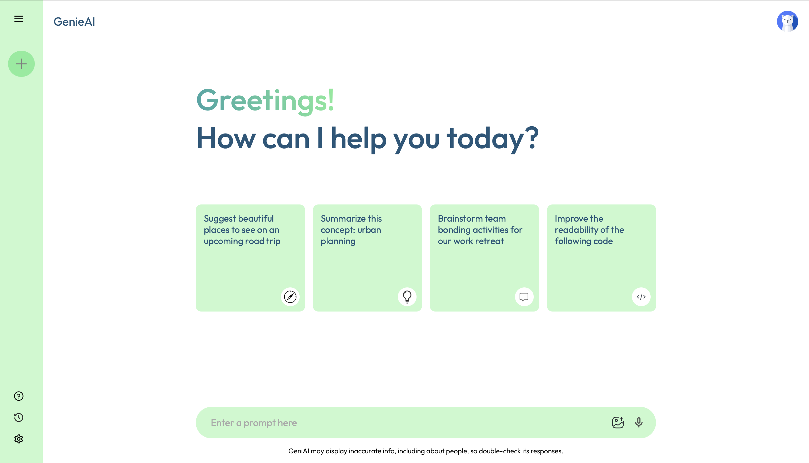

# 🚀 **GenieAI**  

**Created by:** [Yaseen Sadat](https://github.com/YaseenSadat)  
  
  

---

## 🌟 **Summary**  

**GenieAI** is a cutting-edge AI generative app designed to provide users with quick, intelligent, and creative responses for any prompt. Whether you're brainstorming ideas, learning something new, or solving a problem, **GenieAI** has you covered! It leverages OpenAI's powerful API and modern technologies to deliver an interactive and engaging experience.  

---

## ✨ **Features**  

🔹 **Real-Time AI Responses** – Get instant answers and solutions to your prompts powered by OpenAI.  
🔹 **Dynamic Typing Animation** – Watch responses appear dynamically, creating a realistic typing experience.  
🔹 **Clean and Responsive UI** – User-friendly design built with **React** and styled for an engaging experience.  
🔹 **Prompt History** – Access your recent prompts for quick reuse.  
🔹 **Interactive Sidebar** – Easy navigation with options to start new chats, access help, and more.  
🔹 **Loading Animations** – Beautiful loader to keep you engaged while responses are generated.  

---

## 🎥 **Feature Display on YouTube**  

Check out GenieAI in action here: [👉 **YouTube Demo**](https://youtu.be/CF5FSXq1P80)  

---

## 💻 **Technologies Used**  

- **React** ⚛️ – Frontend library for building user interfaces.
- **React Native 🌐** – Cross-platform framework for building mobile and web user interfaces.
- **Node.js** 🟢 – Backend JavaScript runtime environment.  
- **JavaScript** ✨ – Core language for application logic.  
- **HTML** 📝 – Structure for the web application.  
- **CSS** 🎨 – Styling for the UI and responsive design.  
- **Vite** ⚡ – Fast build tool and development server for React.  
- **OpenAI API** 🤖 – AI model integration for generating responses.

---

## 📫 **Connect with Me**  

If you have any questions, feedback, or want to collaborate:  
- GitHub: [Yaseen Sadat](https://github.com/YaseenSadat)  
- LinkedIn: [My LinkedIn Profile](https://www.linkedin.com/in/yaseensadat/)

---

**Give GenieAI a ⭐ on GitHub if you find it helpful!** 🚀  
